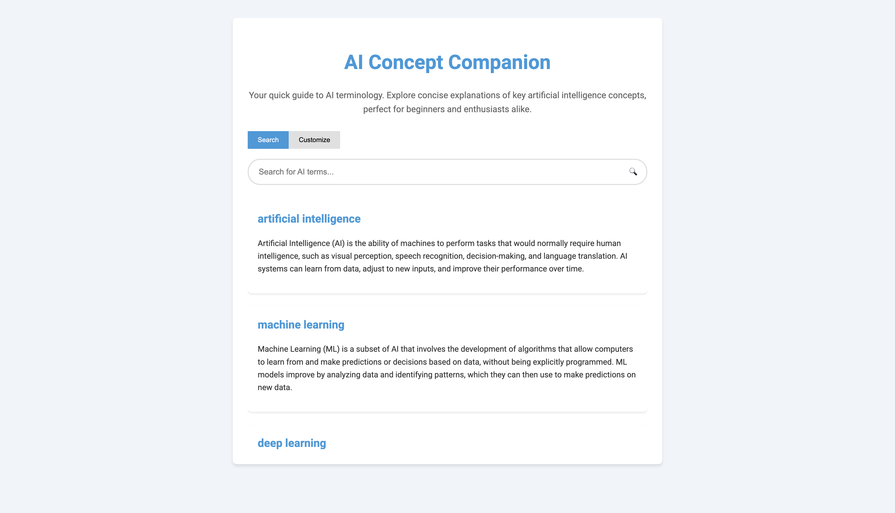

# AI Concept Companion

AI Concept Companion is an interactive web application that serves as a quick guide to AI terminology. It's designed to help beginners and enthusiasts explore and understand key artificial intelligence concepts through concise explanations.

## Features

- **Search Functionality**: Quickly find AI terms and their explanations.
- **Dynamic Results**: Results update as you type, providing instant feedback.
- **Infinite Scrolling**: Load more results as you scroll down the page.
- **Customization Options**: 
  - Choose from multiple color themes
  - Adjust font size
  - Customize highlight color
- **Responsive Design**: Works well on both desktop and mobile devices.
